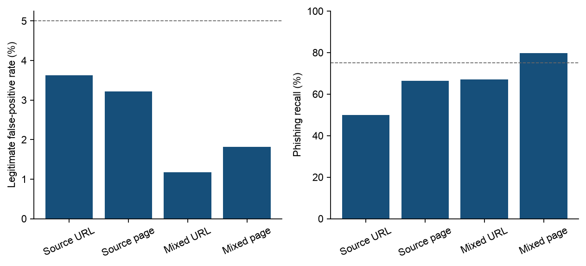
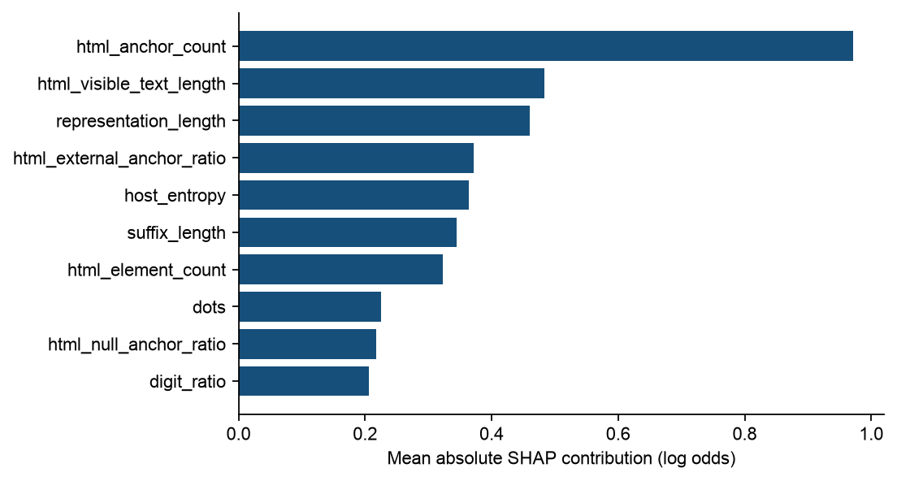

# Raw reproduction and independent phishing evaluation

Executed on 7 October 2026. This note covers the completed raw-only pipeline and a separately frozen evaluation on CompPhish V4. It accompanies the existing thesis draft; it does not silently replace its Mendeley-managed Word document.

## Findings

The selected shared-page model after labelled target development achieves **1.82% legitimate false-positive rate and 79.85% phishing recall** on 7,047 untouched target-domain records. A fixed model trained only on source snapshots gives **3.22% FPR and 66.44% recall** on the identical test records. The former uses CompPhish fitting/calibration folds and must not be described as zero-target-label transfer. It satisfies the prespecified empirical FPR <=5% and recall >=75% targets on this eligible test population. The source-only model misses the recall target.

The new feature contract has 44 URL statistics plus 28 passive DOM aggregations. It differs from the preceding 68-input model. Creator-engineered columns were not renamed or imputed into it. The source provides previously parsed DOM, whereas the target supplies HTML text parsed by lxml; capture/parser differences remain relevant. Initial boosting runs are deterministic across the three fitting seeds; they are not three independent datasets.

| Fitting regime | Features | Calibration-selected family | FPR % | Recall % | Precision % | F1 | AP |
| --- | --- | --- | ---: | ---: | ---: | ---: | ---: |
| mixed_source_development | shared_page_72 | hist_gradient_7 | 1.82 | 79.85 | 96.34 | 0.8732 | 0.9732 |
| mixed_source_development | url_only_44 | hist_gradient_15 | 1.18 | 67.16 | 97.15 | 0.7942 | 0.9506 |
| source_only | shared_page_72 | hist_gradient_7 | 3.22 | 66.44 | 92.51 | 0.7734 | 0.9209 |
| source_only | url_only_44 | hist_gradient_15 | 3.63 | 49.96 | 89.18 | 0.6404 | 0.8763 |

Every model and cutoff was selected using only its specified calibration roles. All 60 candidate fits and 120 test ledgers are retained, including candidates that perform worse. The test outcomes do not select a replacement winner.



## Data provenance and population

CompPhish V4 is a separately collected archive, not a repackaging of the preceding corpora. Its creator supplies URL/label/serial mappings and HTML snapshots; their byte hashes and exact association were checked. Shared PhishTank/OpenPhish inputs mean that separate collectors do not prove campaign independence. [Creator release](https://data.mendeley.com/datasets/fmbs4kp9wz/4), [primary article](https://doi.org/10.1016/j.dib.2026.113219).

Hannousse V3 supplies the older DOM archive. The actual ten archived parts contain 1,000 snapshots, a subset of its 11,430 feature-CSV rows. The retained new representation has 945 source records. Serialized objects were read through an inert data-opcode interpreter; pickle globals, constructors, REDUCE and downloaded Python code were not executed. [Creator release](https://data.mendeley.com/datasets/c2gw7fy2j4/3).

The target published mapping has 15,358 records. Eligibility removes extraction failures, normalized-URL duplication, repeated semantic-DOM content, mixed-label content clusters and source overlap. **Identical content at different URLs can legitimately carry different phishing labels**; the 233 mixed-label content rows are a predeclared isolation/population exclusion, not a finding that the labels are wrong. The 2,032 repeated-content rows are also excluded. Results therefore concern eligible unique-content records, not every published CompPhish row or production traffic.

All target domains occurring in the complete retained source CSV were excluded before splitting; target/source normalized content overlap is also excluded. After filtering, 11,740 target records remain: fitting and calibration each take one grouped fold, and final testing takes three folds. These are fixed roles, not fivefold cross-validation. Per-record times are unavailable, so collection periods do not establish natural-time drift.

| Role | Rows | Legitimate | Phishing | Registered domains |
| --- | ---: | ---: | ---: | ---: |
| sealed_test | 7047 | 4407 | 2640 | 6226 |
| source_calibration | 258 | 167 | 91 | 240 |
| source_train | 687 | 418 | 269 | 558 |
| target_calibration | 2346 | 1468 | 878 | 2076 |
| target_train | 2347 | 1468 | 879 | 2076 |

## Exclusion breakdown

The sequential exclusions affect phishing rows more strongly. Domain counts are distinct within each reason/class and cannot be summed across reasons. This population change is part of the result scope.

| Source | Reason | Published class | Rows | Domains |
| --- | --- | --- | ---: | ---: |
| CompPhish | content_hash_mixed_label_cluster | legitimate | 38 | 38 |
| CompPhish | content_hash_mixed_label_cluster | phishing | 195 | 113 |
| CompPhish | content_hash_repeated_record | legitimate | 56 | 50 |
| CompPhish | content_hash_repeated_record | phishing | 1976 | 1192 |
| CompPhish | extraction_failed | legitimate | 8 | 7 |
| CompPhish | extraction_failed | phishing | 3 | 3 |
| CompPhish | normalized_repeated_record | legitimate | 33 | 33 |
| CompPhish | normalized_repeated_record | phishing | 28 | 26 |
| CompPhish | source_domain_overlap | legitimate | 676 | 448 |
| CompPhish | source_domain_overlap | phishing | 605 | 33 |
| Hannousse_DOM | content_hash_repeated_record | phishing | 36 | 25 |
| Hannousse_DOM | extraction_failed | phishing | 19 | 19 |

Target retention is 7,343/8,154 legitimate records and 4,397/7,204 phishing records. Repeated phishing templates account for much of the reduction; filtered performance is not a frequency-weighted estimate for all captured attacks.

## Conditional uncertainty and explanations

Whole-domain resampling uses 1,000 draws and fitting seed 42. Intervals are conditional on these fitted models and this corpus. They exclude source-label error, split choice, unobserved campaign sharing and future sites. Pipeline comparisons change fitting/calibration information and sometimes selected model family; they do not establish a causal feature-only effect.

| Selected page pipeline | FPR 95% interval % | Recall 95% interval % |
| --- | ---: | ---: |
| Source-only | 2.62 to 3.91 | 60.66 to 71.06 |
| Mixed-source development | 1.43 to 2.21 | 76.02 to 83.37 |

For mixed-minus-source page predictions, the paired FPR difference interval is -1.96 to -0.91 percentage points and the recall difference interval is 10.84 to 16.43 points. This supports improvement within the evaluated protocol, without establishing universal transfer.

TreeSHAP reconstructs the selected mixed-source boosting output in log odds on 200 test records; maximum absolute residual is 6.217e-15. Explanations are fitted-model associations, not causal security rules or demonstrated improvements in human trust.



## Reproduction and verification

The original URL/page pipeline was executed in a fresh workspace containing only tracked code/configuration and the three creator CSVs. Legacy processed data, features, fitted models and experiment directories were not copied. Eligibility and domain manifests reproduce the reference bytes; all 96 page decision vectors and the selected URL model agree. One early rerun also matched all historical forest decisions, but another exposed boundary flips from parallel forest probability summation at machine precision. Subsequent executions fix forest inference to one worker while retaining parallel fitting; this numerical amendment and historical differences are reported separately.

The amended raw-only runs reproduction_20261007_06 and reproduction_20261007_07 both complete all six stages. Their verified inputs, execution source hashes, pinned environment, role/training manifests, calibration selections and cutoffs, 45 saved URL score archives, 96 complete page prediction ledgers, 84 URL metric rows and 48 policy/final-test metric rows agree exactly, with no numerical tolerance. Wall-clock durations and timestamps are execution metadata and are not required to match. The post-run comparison receipt is reproduction_20261007_07/determinism_comparison.json. This does not retroactively assert identical decisions for historical parallel-forest boundary examples.

The independent pipeline was also rerun from creator archives in a second clean workspace. All 120 test decision vectors and training/partition manifests agree. These reruns establish reproducibility on the pinned environment, not independent population replications.

The separate verifier checks 120 saved prediction files, 60 model specifications, raw creator labels, complete-source domain exclusion, checkpoint scores and calibration-only selection. It independently recomputes confusion matrices and ranking metrics. Public labels are adopted and not relabelled through current website visits.

```sh
.venv/bin/python scripts/reproduce.py --output-dir experiments/fresh_original_reproduction
.venv/bin/python scripts/reproduce_independent.py --output-dir experiments/fresh_independent_reproduction
```

These default commands use existing verified raw inputs. Optional --download acquires missing creator inputs; public hosts can time out, and acquisition attempts are not described as completed experiment runs. Use a fresh output directory; existing evidence is never overwritten. The independent workflow requests only its actual sources, without depending on the UCI download. See README.md for prerequisites and source acquisition commands.

## Evidence and remaining limits

- Protocol and execution sources: experiments/independent_20261007_02/source.
- Row/domain/content lineage and all measurements: its artifacts directory.
- Explanation and cluster intervals: its analysis directory.
- Original raw-only reproduction: experiments/reproduction_20261007_02; later complete reruns retain their own manifests.
- Independent clean reproduction: experiments/independent_reproduction_20261007_01 and subsequent audited rerun.

Attribution reconstruction and calculation consistency do not certify deployment. The source snapshot subset is small and has different parsing/collection characteristics; source visible-text sparsity is higher than target sparsity. Content normalization cannot detect every template or campaign. Mixed-label content exclusions can remove difficult legitimate/phishing clones, so filtered-population performance should not be extrapolated to them. A natural chronological stream and live content extraction are outside this experiment.
